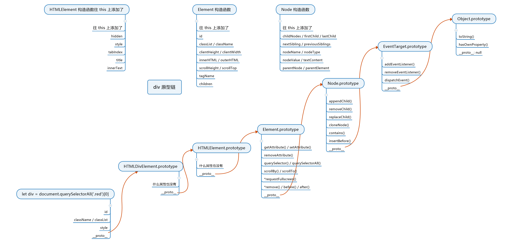
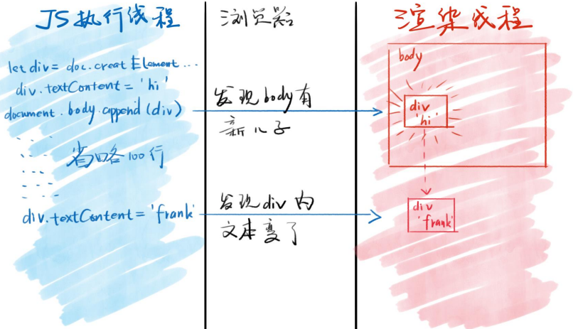

<!-- 03.28: 2.5h -->
# DOM 概述
DOM（Document Object Modal），直译文档对象模型。DOM 模型用一个逻辑树来表示一个文档，树的每个分支的终点都是一个节点(node)，每个节点都包含着对象(objects)。

DOM 非常难操作，属于 JS 的原创部分。了解 DOM 之后，如果觉得 DOM 反人类，那么自信点，把“觉得”去掉，DOM 就是反人类。

## 获取元素\标签
* window.idxxx | idxxx
* document.getElementById('idxxx')
* document.getElementsByTagName('div')[0]
* document.getElementsByClassName('red')[0]
* document.querySelector('#idxxx')
* document.querySelectorAll('.red')[0]

使用建议：
* 工作中用 querySelector 和 querySelectorAll。
* 做 demo 直接用 idxxx，自己用就好，因为这种方法简便但少人用。
* 要兼容 IE 才使用 getElement(s)ByXxx

1. 获取 html 元素：document.documentElement
2. 获取 head 元素：document.head
3. 获取 body 元素：document.body
4. 获取窗口（但窗口不是元素）：window
5. 获取所有元素：document.all。<strong>注意！document.all 属于第六个 falsy 值</strong>，即 if (document.all) 判断为<strong>假</strong>。

### 标签原型链
以 div 为例子：



图看不清楚的话，以下用文字表述：
* div1.\_\_proto__ = HTMLElement.prototype
* HTMLElement.\_\_proto__ = Element.prototype，HTMLElement 和 Element 区别：div 是 HTML 元素，但是浏览器还能解析其他文本标签比如 XML 的，因此有了 Element 原型。
* Element.\_\_proto__ = Node.prototype，Node 包含所有节点共有属性，节点包括 XML 标签文本注释、HTML 标签文本注释等等。
* Node.\_\_proto__ = EventTarget
* EventTarget.\_\_proto__ = Function.prototype

mdn 对 Node 类型有详细的表述（<a href='https://developer.mozilla.org/zh-CN/docs/Web/API/Node/nodeType'>完整描述</a>）。其中着重记住以下两个：
* xxx.nodeType = 1 表示元素 Element，也叫标签 Tag。
* xxx.nodeType = 3 表示文本 text。

### 节点的增删改查
#### 增
* 创建标签节点
* 
``` JavaScript
    let div1 = document.createElement('div');
    document.createElement('style');
    document.createElement('script');
    document.createElement('li');
```
* 创建文本节点
  
``` JavaScript
    let text1 = document.createTextNode('hello');
```

* 标签里加入文本

``` JavaScript
    div1.appendChild(text1); // 注意，参数类型不是字符串，而是文本节点。
    div1.innerText = 'hello'; // 将字符串文本直接赋值给 innerText。
```

* 将节点插入到页面中

创建节点后，节点对象默认处于 JS 线程中，必须手动将它们插入到 head 或者 body 里边，节点内容才会生效。

``` JavaScript
    document.body.appendChild(div1);
    已在页面中的元素.appendChild(div1)；
```

如果相同对象先后被插入到不同的标签里，那么该对象只会出现在最后赋值的那个标签里：

``` JavaScript
    let div1 = document.createElement('div');
    divFather1.appendChild(div1);
    divFather2.appendChild(div1);
    // divFather1 没有 div1 内容，而 divFather2 有。
```

#### 删
``` JavaScript
    * parentNode.removeChild(childNode1); // 旧写法
    * childNode1.remove(); // 新写法
```

思考：执行上述任一一条删除语句后，节点对象 childNode1 还能回到页面中吗？

答：可以。上述的删除只是将节点对象从页面中移出，但 变量 childNode1 依旧保存着地址，因此本质上节点对象没有被根除。

``` JavaScript
    // 根除节点方法
    childNode1 = null;
```

#### 改
* 写标准属性

``` JavaScript
    // 改写 class 内容: 
    div.className = 'red'; // 覆盖方式: class = 'red'
    div.classList.add('red'); // 添加方式: class += 'red'
    //改写 style 内容: 
    div.style = 'width:100%,color:blue,background-color = "red"');
    div.style.width = 200px; // 对比上一行写法，这一行有个问题就是：加入属性名有段杠号的话，那么 JS 会将段杠号是为 减号。因此改 background-color 的时候写成：把 backgroundColor = xxx。即：
    div.style.backgroundColor = 'white';
    改 data-* 属性: div.dataset:x = 'yyy';
```

* 读标准属性

``` JavaScript
    div.classList | a.href
    div.getAttribute('class') | a.getAttribute('href');
```

* 改事件处理函数

``` JavaScript
    div.onclick = null; // onclick 默认值
    div.onclick = (x) => {console.log(x);}; // onclick 指向箭头函数，在这里 this 等于 div。
```

由于 onclick 只能调用一个函数，因此出现了新语法:

``` JavaScript
    div.addEventListener
```

* 改其他

``` JavaScript
    // 改文本内容:
    div.innerText = 'newXxx';
    div.textContent = 'newXxx';

    // 改HTML内容:
    div.innerHTML = '<h2>XXX</h2>';

    // 改标签：
    div.innerHTML = ''; // 先清空
    div.appendChild(div2); // 将 div2 内容加到 div 文本中去。

    // 改爸爸：
    newDiv.appendChild(div);
```

#### 查
* 查爸爸

node.parentNode | node.parentElement

* 查爷爷

node.parentNode.parentNode | node.parentElement.parentElement

* 查子代

``` JavaScript
    node.children | node.childNodes

    // 例题，children 和 childNodes的区别：
    document.body.innerHTML = `
        <div id='div1'>
            <li>1</li>
            <li>2</li>
            <li>3</li>
        </div>
    `;
    console.log(div1.children.length); // 打印：3
    console.log(div1.childNodes.length); // 打印：7
```
上述代码中 childNode 会将空格、换行都算在子代里边，所以打印 7。因此，一般情况下建议用 children 来查子代。

``` JavaScript
    // 例题，当子代变化时，children、childNodes 和 querySelectorAll 之间 length 的区别：
    document.body.innerHTML = `
        <div id='div1'>
            <li id='li1'>1</li>
            <li>2</li>
            <li>3</li>
        </div>
    `;
    let temp = document.querySelectorAll('li');

    console.log(temp.length); // 3
    console.log(div1.children.length); // 3
    console.log(div1.childNodes.length); // 7

    li1.remove();
    console.log(temp.length); // 3
    console.log(div1.children.length); // 2
    console.log(div1.childNodes.length); // 6
```

上述代码表明，querySelectorAll 得到的对象长度 length 不会实时变化，children、childNodes 的长度 length 会实时变化。

* 查兄弟姐妹

第一步，node.parentElement.children | node.parentNode.childNodes
第二步，上述找到的子代会包含自己，因此要用 for 循环将自己干掉。

* 查子代首位和末位

node.firstChild

node.lastChild

* 查上一个哥哥/姐姐

node.previousSibling(包含空格、回车) | node.previousElementSibling（不包含空格、回车）

* 查下一个弟弟/妹妹

node.nextSibling(包含空格、回车) | node.nextElementSibling（不包含空格、回车）

* 遍历 div1 中所有元素：

``` JavaScript
    let travel = (node, fn) => {
        fn(node);
        for (let i = 0; i < node.children.length; i++) {
            travel(node.children[i], fn);
        }
    }
    travel(div1, (node) => console.log(node));
```

## DOM 跨线程操作

为什么DOM操作比较慢？就是因为 DOM 操作是跨线程的。可以参考<a href='https://segmentfault.com/a/1190000004114594'>国内</a>和<a href='https://stackoverflow.com/questions/6817093/but-whys-the-browser-dom-still-so-slow-after-10-years-of-effort'>国外</a>两篇文章。

浏览器分为渲染引擎和 JS 引擎。

各线程各司其职，JS 引擎不能操作页面，只能操作 JS；同样地，渲染引擎不能操作 JS，只能操作页面。那么，document.body.appendChild(di1) 这句 JS 如何操作页面？



通过跨线程通信。浏览器发现 JS 在 body 里加了 div1 对象，就会通知渲染引擎在页面里新增一个 div 元素，该元素所有属性照抄 div1 对象。

之后，如果你对 div1 再用 JS 修改，那么<a href='https://css-tricks.com/css-content/#article-header-id-4'>有可能</a>会触发重新渲染。对 div1 多次 JS 修改，浏览器可能会合并成一次操作，也可能不会，如下：

``` JavaScript
    document.body.innerHTML = `
        <div id="test"></div>
        <style>
            .start{
            border: 1px solid red;
            width: 100px;
            height: 100px;
            transition: width 1s;
            }

            .end{
            width: 200px;
            }
        </style>
    `;

    test.classList.add('start');
    test.clientWidth; // 在浏览器上 test 用 1s 时间改变宽度到 200px，不写则宽度直接设为 200px。这句话看似无用，实际会触发重新渲染。
    test.classList.add('end');
```

### 属性同步

``` JavaScript
    document.body.innerHTML = `
        <div id="test" x="test" data-x="test">
    `;
```

对 div1 的标准属性（如 id、className、title等）修改，会被浏览器同步到页面中。

对 div1 的 data-* 属性修改也会触发同步。

但是，对非标准属性（如上述代码中的属性 x）修改则修改效果只会停留在 JS 线程中，浏览器的渲染引擎不会管非标准属性，即不同步到页面中。

<strong>建议</strong>，如果你有自定义属性，又想被同步到页面中，则使用 data- 作为前缀。

### property 和 attribute

JS 线程中 div1 所有属性叫做 div1 的 property；渲染引擎中 div1 标签所有属性叫做 attribute。区别：
* 一般情况下同名的 property 和 attribute 值相等。
* 非标准属性只会在一开始相等。
* attribute 值只支持字符串，property 支持字符串、布尔等类型。
